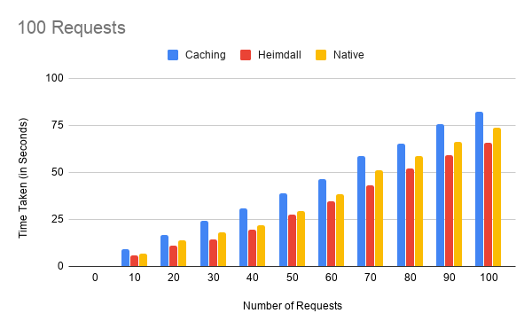
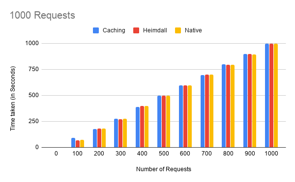

# Analysing Heimdall — Gojek's HTTP Go Client


## What is Heimdall?

[Heimdall](https://github.com/gojek/heimdall) is [Gojek's](https://www.gojek.io/) HTTP Client that replaces Go's native HTTP client. 

It builds upon the the default libary and adds a few critical features that add robustness to the application. It allows graceful handling for failing requests, allows one to dictate retrying rules and allows one to define a different timeout for each HTTP request.


	
## Heimdall use-cases

Heimdall (as correctly pointed in their FAQ section) is excellent for cases where the number of requests are high and it is infeasible to do custom error handling for each request. 

However, they also claim that the Heimdall can be used in small-scale applications. This is what their Github page says:

>Although Heimdall was made keeping large scale systems in mind, it's interface is simple enough to be used for any type of systems. In fact, we use it for our pet projects as well. Even if you don't require retries or circuit breaking features, the simpler HTTP client provides sensible defaults with a simpler interface, and can be upgraded easily should the need arise.

I wanted to put this claim to test. Are the wins of error handling and sensible defaults worth the (possible) additional overhead involved? 


---

## Designing the Test

### Objective

To make multiple requests and measure Heimdall's performance over the native client to see how it performs under various load states.

### Test Method

I needed to pick a HTTP resource that can be called multiple times. 
#### Candidate 1 - Hacker News
[Hacker News](https://news.ycombinator.com) is light-weight and will probably not rate-block me. It being light-weight ensured that the requests would not be timed out. However, I quickly realised that after the first request, the response was cached and the subsequent requests were quick and defeated the purpose of the test. 

#### Candidate 2 - Postman Echo
[Postman Echo](https://postman-echo.com) is a service explicitly designed to test HTTP testpoints. It even had a ```GET Current UTC time``` endpoint that I could use to timestamp my requests. However, I ran into a different problem, it was too lightweight. The first request, that probably had the overhead of a DNS lookup was slow but subsequent requests were too quick. I would need to make a very large number of requests to measure performance. 

#### Candidate 3 - Top 1 million website by traffic
I needed a large number of different websites to hit. I zeroed in on [Alexa's database of top 1 million most popular website by traffic](https://www.kaggle.com/cheedcheed/top1m). It gave me varying websites with a high degree of availabiility. So this is what I chose for my test.

### Solving the caching issue
Subsequent requests to the same websites were faster because DNS lookups were being cached. To give both Heimdall and the native client a level playing field, I decided to run the request once and check their performance on requests on those 2 requests. 

#### Quick aside:  HTTP Timeout handling in Go's native HTTP client

For legacy reasons, Go's native HTTP libary, does not define a timeout by default. This is not ideal. Therefore it is highly recommended to define a timeout for the client. 

	//this defines a 5 second timeout
	client := http.Client{Timeout: 5 * time.Second}

I set a *1 second* timeout for both Heimdall and the Native client. Some content heavy websites like amazon.com could  timeout out before recieving a response but that would be the same across both clients. 

### Results

#### 100 Requests

Time taken to complete upto 100 requests:
resources/1000r.png



The time taken for the caching the DNS responses are consistently higher than the subsequent requests. This is in line with what was expected.

However, the fact that Heimdall was marginally faster than Go's native client did surprise me. The hypothesis of HTTP requests slowing down due to some overhead in Heimdall is incorrect. 
On inspecting the code for Heimdall's ```GET``` requests, it is clear that Heimdall is in fact using Go's native client underneath (It would be somewhat of an overkill to re-write the entire http stack).

	// Heimdall's GET request method
	func (c *Client) Get(url string, headers http.Header) (*http.Response, error) {
		var response *http.Response
		request, err := http.NewRequest(http.MethodGet, url, nil)
		if err != nil {
			return response, errors.Wrap(err, "GET - request creation failed")
		}

		request.Header = headers

		return c.Do(request)
	}


One plausible explanation for Heimdall being marginally faster than Go's native client could be some part of response being cached that was not cached during the dns-cache call. 

#### 1000 requests

Time taken to complete upto 1000 requests:



These results were more palatible. The performance across all 3 runs is near identical. This is explained by the fact that the DNS caching/response caching were not staying in the cache long enough when the number of requests increased. More over the average standard deviation in response time between 200 and 1000 requests was a smidge over 2 seconds. The same metric for response times between 10 and 100 requests was over 5 seconds. 

### Conclusion

Heimdall is a feature packed HTTP client library and is ideal for use-cases that require higher fault tolerance and more robustness with almost no performance penalty. It is thus also a well suited replacement over Go's native library even in small applications. 


